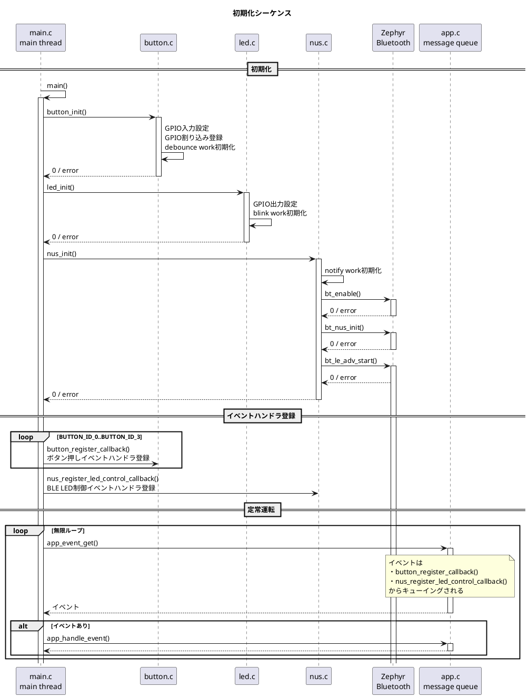
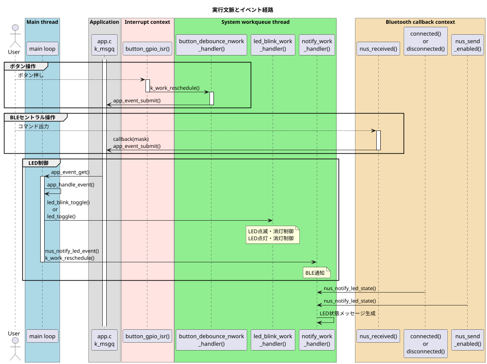
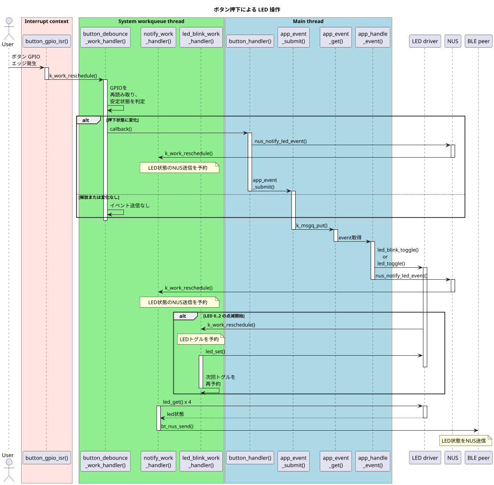
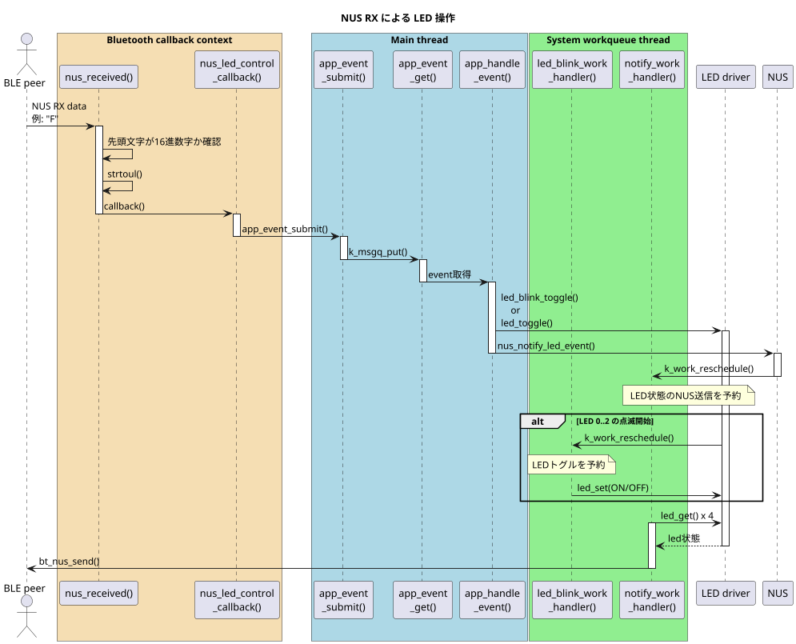
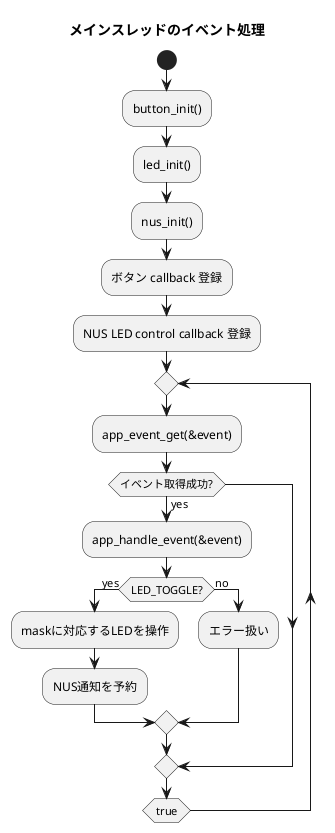
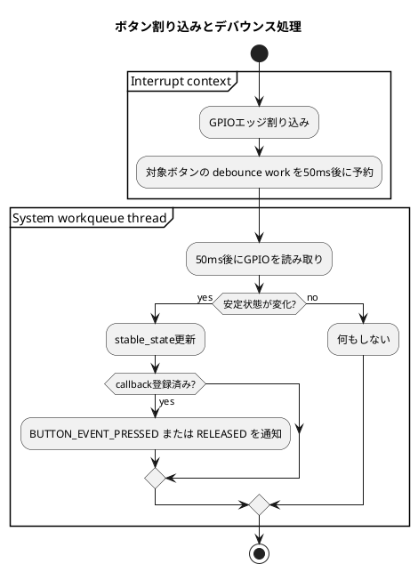

# Blinky NUS アプリケーション仕様書

## 1. 目的

本アプリケーションは、ボード上の 4 個のボタンと 4 個の LED を制御し、Bluetooth LE の Nordic UART Service (NUS) 経由で LED 状態を通知・操作する Zephyr OS アプリケーションである。

主な機能は次のとおり。

- ボタン押下に応じて対応する LED の点滅または点灯状態を切り替える。
- BLE Peripheral として advertising し、NUS で外部機器と通信する。
- NUS RX で受信した 16 進数文字列を LED 操作用ビットマスクとして扱う。
- LED 状態を NUS TX notification で通知する。

本書は、C 言語は理解しているが Zephyr OS には詳しくない読者を想定している。

## 2. 前提と確認事項

### 2.1 前提

- 対象 LED は `LED_ID_0` から `LED_ID_3` の 4 個である。
- 対象ボタンは `BUTTON_ID_0` から `BUTTON_ID_3` の 4 個である。
- devicetree alias として `led0` から `led3`、`sw0` から `sw3` が利用可能であることを前提とする。
- BLE デバイス名は `CONFIG_BT_DEVICE_NAME` により `Blinky_NUS` である。
- BLE 接続数は `CONFIG_BT_MAX_CONN=1` により最大 1 接続である。
- LED とボタンの GPIO 極性は devicetree の `gpios` 定義に従う。

### 2.2 不明点・確認したい点

現在の実装から読み取れる仕様を本書に記載しているが、次の点は要求仕様として明文化されていないため、必要に応じて確認が必要である。

- `README.rst` は Zephyr 標準 blinky サンプルの説明に近く、現在の BLE/NUS・ボタン 4 個対応の実装内容とは一致していない。
- ボタン押下時、`main.c` の `button_handler()` と `app.c` の `app_toggle_leds()` の両方から `nus_notify_led_event()` が呼ばれるため、通知予約が重複する可能性がある。ただし Zephyr の delayable work は再スケジュールされるため、実際の通知は最後の予約にまとまる。
- `nus_received()` は `len == 0` の場合でも `data[0]` を参照する実装になっている。NUS が 0 バイト受信を渡さない前提であれば問題になりにくいが、防御的には `len > 0` の確認が必要である。
- `led_blink_stop()` は `m_led_contexts[id].is_on = false` を設定してから `led_set(... OFF)` を呼ぶため、状態更新は結果的に OFF になる。GPIO 設定失敗時の内部状態の扱いを厳密にするかは未定義である。
- `app_toggle_leds()` の戻り値は最後に処理した LED 操作の結果になるが、`app_handle_event()` はその値を利用していない。

## 3. システム構成

### 3.1 ソースファイル構成

| ファイル | 役割 |
| --- | --- |
| `src/main.c` | 初期化、コールバック登録、アプリケーションイベント処理ループ |
| `src/app.c` / `src/app.h` | アプリケーションイベントキューとイベント処理 |
| `src/button.c` / `src/button.h` | ボタン GPIO 入力、割り込み、デバウンス、ボタンコールバック |
| `src/led.c` / `src/led.h` | LED GPIO 出力、点灯・消灯・トグル・点滅制御 |
| `src/nus.c` / `src/nus.h` | Bluetooth LE 初期化、NUS 通信、LED 状態通知、BLE からの LED 操作受付 |
| `prj.conf` | Zephyr 設定。GPIO、BLE、NUS、デバッグ情報を有効化 |
| `boards/*.overlay` | ボードごとの devicetree 上書き |

### 3.2 Zephyr OS の基本要素

本アプリケーションで使う Zephyr の主な仕組みは次のとおり。

| Zephyr 要素 | 使用箇所 | 説明 |
| --- | --- | --- |
| `main()` | `src/main.c` | Zephyr アプリケーションのメインスレッドとして実行される |
| GPIO driver | `button.c`, `led.c` | devicetree で定義された GPIO を入力・出力として扱う |
| GPIO interrupt callback | `button.c` | ボタン GPIO のエッジ変化時に割り込み文脈で呼ばれる |
| `k_work_delayable` | `button.c`, `led.c`, `nus.c` | 指定時間後に system workqueue スレッドで処理を実行する |
| `k_msgq` | `app.c` | スレッド間・コールバック間でイベントを受け渡す固定長キュー |
| Bluetooth callbacks | `nus.c` | BLE 接続、切断、NUS 受信、notification 有効化などで呼ばれる |

重要な点として、GPIO 割り込みや BLE コールバック内で重い処理を直接行わず、メインループや workqueue に処理を渡す構成になっている。

## 4. 全体動作

### 4.1 初期化の流れ

`main()` は次の順序で初期化する。

1. `button_init()` で各ボタン GPIO を入力として設定し、両エッジ割り込みとデバウンス work を準備する。
2. `led_init()` で各 LED GPIO を出力として設定し、点滅 work を準備する。
3. `nus_init()` で Bluetooth LE と NUS を初期化し、advertising を開始する。
4. 全ボタンに対して `button_handler()` を登録する。
5. NUS から LED 操作指示を受けるため、`nus_led_control_callback()` を登録する。
6. 無限ループで `app_event_get()` によりイベントを待ち、取得したイベントを `app_handle_event()` へ渡す。

### 4.2 実行時の主要なデータフロー

ボタン、BLE、LED 点滅はそれぞれ異なる文脈から発生する。

- ボタン入力は GPIO 割り込みを起点に、デバウンス work を経由してアプリケーションイベントになる。
- BLE 受信は NUS の受信コールバックを起点に、アプリケーションイベントになる。
- LED 点滅は LED ごとの delayable work により周期的にトグルされる。
- NUS 通知は notification 用 delayable work により BLE peer へ送信される。

## 5. 機能仕様

### 5.1 ボタン入力

各ボタンは devicetree alias `sw0` から `sw3` で取得される GPIO と対応する。

| ボタン | 対応 LED | 押下時イベント |
| --- | --- | --- |
| `BUTTON_ID_0` | `LED_ID_0` | `led_mask = 0x01` |
| `BUTTON_ID_1` | `LED_ID_1` | `led_mask = 0x02` |
| `BUTTON_ID_2` | `LED_ID_2` | `led_mask = 0x04` |
| `BUTTON_ID_3` | `LED_ID_3` | `led_mask = 0x08` |

GPIO は pull-up 入力として設定され、GPIO 値 `0` を押下、`1` を解放として扱う。割り込みは両エッジで発生するが、アプリケーションイベントは押下イベントの場合のみ生成される。

デバウンス時間は `BUTTON_DEBOUNE_MS` により 50 ms である。

### 5.2 LED 制御

LED は devicetree alias `led0` から `led3` で取得される GPIO と対応する。

アプリケーションイベント `APP_EVENT_TYPE_LED_TOGGLE` を処理すると、ビットマスクに応じて次の動作を行う。

| bit | LED | 動作 |
| --- | --- | --- |
| bit 0 | `LED_ID_0` | 500 ms ON / 500 ms OFF の点滅を開始または停止 |
| bit 1 | `LED_ID_1` | 250 ms ON / 250 ms OFF の点滅を開始または停止 |
| bit 2 | `LED_ID_2` | 125 ms ON / 125 ms OFF の点滅を開始または停止 |
| bit 3 | `LED_ID_3` | GPIO 出力状態を単純にトグル |

`LED_ID_0` から `LED_ID_2` は `led_blink_toggle()` により点滅状態を切り替える。点滅中であれば停止して OFF にし、停止中であれば指定周期で点滅を開始する。

### 5.3 BLE / NUS 通信

本アプリケーションは BLE Peripheral として動作し、Nordic UART Service を advertising する。

Advertising data には NUS UUID が含まれる。Scan response data には `CONFIG_BT_DEVICE_NAME`、つまり `Blinky_NUS` が含まれる。

NUS の役割は次のとおり。

| 方向 | 内容 |
| --- | --- |
| NUS RX | peer から LED 操作用の 16 進数文字列を受信する |
| NUS TX notification | peer へ LED イベントまたは LED 状態を通知する |

NUS RX で受信したデータの先頭文字が 16 進数字であれば、`strtoul(data, NULL, 16)` で `uint32_t` の LED マスクに変換し、登録済み callback へ渡す。

例:

| 受信文字列 | 解釈 | 動作 |
| --- | --- | --- |
| `1` | `0x01` | LED 0 の点滅状態を切り替え |
| `2` | `0x02` | LED 1 の点滅状態を切り替え |
| `4` | `0x04` | LED 2 の点滅状態を切り替え |
| `8` | `0x08` | LED 3 をトグル |
| `F` | `0x0F` | LED 0 から LED 3 をまとめて操作 |

### 5.4 NUS 通知メッセージ

NUS TX notification は `notify_work_handler()` で送信される。送信予約から 50 ms 後に実行される。

メッセージ形式は次のとおり。

| 種別 | 形式 | 意味 |
| --- | --- | --- |
| LED イベント通知 | `B<led_id> L=<mask>\n` | 指定 LED に関係するイベントが発生した |
| 状態通知 | `N<count> L=<mask>\n` | 現在の LED 状態通知 |

`mask` は現在 ON と認識されている LED のビットマスクである。bit 0 が LED 0、bit 1 が LED 1、bit 2 が LED 2、bit 3 が LED 3 に対応する。

通知は `m_notify_enabled == true` の場合のみ送信される。これは peer が NUS TX characteristic の notification を有効化した状態を意味する。

### 5.5 ボタン押下から LED 制御までの流れ

### 5.6 BLE 受信から LED 制御までの流れ

### 5.7 アクティビティ図

メインスレッドのアクティビティ図ではエラー表示、終了については表記の冗長性を排除するために省略している。

## 6. ファイル別関数仕様

### 6.1 `src/main.c`

#### `int main(void)`

- 内容: アプリケーション全体を初期化し、イベント処理ループを実行する。
- 引数: なし。
- 戻り値:
  - 通常は戻らない。
  - 初期化または callback 登録に失敗した場合は `-1` を返す。
- 詳細:
  - `button_init()`, `led_init()`, `nus_init()` を順に呼ぶ。
  - 各ボタンに `button_handler()` を登録する。
  - NUS LED 制御 callback として `nus_led_control_callback()` を登録する。
  - `app_event_get()` でイベントを待ち、取得したイベントを `app_handle_event()` で処理する。

#### `static void button_handler(BUTTON_ID id, BUTTON_EVENT event)`

- 内容: ボタンイベントを受け取り、押下時に LED 操作用イベントを送信する。
- 引数:
  - `id`: 発生元ボタン ID。
  - `event`: ボタンイベント種別。
- 戻り値: なし。
- 詳細:
  - `BUTTON_EVENT_PRESSED` の場合のみ処理する。
  - ボタン ID に応じて `led_mask` を `0x01`, `0x02`, `0x04`, `0x08` に設定する。
  - `nus_notify_led_event((LED_ID)id)` で NUS 通知を予約する。
  - `app_event_submit(APP_EVENT_TYPE_LED_TOGGLE, led_mask)` でメインループへ LED 操作イベントを送る。

#### `static void nus_led_control_callback(uint32_t led_mask)`

- 内容: BLE/NUS から受信した LED 操作用マスクをアプリケーションイベントへ変換する。
- 引数:
  - `led_mask`: 操作対象 LED を表すビットマスク。
- 戻り値: なし。
- 詳細:
  - `app_event_submit(APP_EVENT_TYPE_LED_TOGGLE, led_mask)` を呼ぶ。

### 6.2 `src/app.c`

#### `int app_event_get(APP_EVENT *event)`

- 内容: アプリケーションイベントキューから次のイベントを取得する。
- 引数:
  - `event`: 取得したイベントを書き込むポインタ。
- 戻り値:
  - `0`: 成功。
  - 負数: `event == NULL`、または `k_msgq_get()` のエラー。
- 詳細:
  - `k_msgq_get(&m_event_queue, event, K_FOREVER)` を使用する。
  - イベントがない場合、呼び出し元スレッドは待機する。

#### `int app_handle_event(const APP_EVENT *event)`

- 内容: イベント種別に応じてアプリケーション処理を実行する。
- 引数:
  - `event`: 処理対象イベント。
- 戻り値:
  - `0`: 成功。
  - `-1`: `event == NULL`、または未知のイベント種別。
- 詳細:
  - `APP_EVENT_TYPE_LED_TOGGLE` の場合、`app_toggle_leds(event->led_mask)` を呼ぶ。
  - 処理内容を `printf()` で出力する。

#### `int app_event_submit(APP_EVENT_TYPE type, uint32_t led_mask)`

- 内容: アプリケーションイベントをイベントキューへ投入する。
- 引数:
  - `type`: イベント種別。
  - `led_mask`: LED 操作用ビットマスク。
- 戻り値:
  - `0`: 成功。
  - 負数: `k_msgq_put()` のエラー。キュー満杯の場合もエラーになり得る。
- 詳細:
  - `K_NO_WAIT` で投入するため、キューが満杯でも待たない。
  - キューサイズは `APP_EVENT_QUEUE_SIZE` により 10 件である。

#### `static int app_toggle_leds(uint32_t led_mask)`

- 内容: ビットマスクに従って LED を操作する。
- 引数:
  - `led_mask`: 操作対象 LED を示すビットマスク。
- 戻り値:
  - `0`: 最後に実行した LED 操作が成功。
  - 負数: LED 操作失敗、または対象 bit がない場合の初期値 `-1`。
- 詳細:
  - bit 0 が立っていれば `LED_ID_0` を 500 ms 周期で点滅開始・停止する。
  - bit 1 が立っていれば `LED_ID_1` を 250 ms 周期で点滅開始・停止する。
  - bit 2 が立っていれば `LED_ID_2` を 125 ms 周期で点滅開始・停止する。
  - bit 3 が立っていれば `LED_ID_3` をトグルする。
  - 操作した LED ごとに `nus_notify_led_event()` を呼ぶ。

### 6.3 `src/button.c`

#### `int button_init(void)`

- 内容: 全ボタンの GPIO 入力、割り込み、デバウンス work を初期化する。
- 引数: なし。
- 戻り値:
  - `0`: 成功。
  - `-1`: GPIO device 未準備、GPIO 設定失敗、callback 登録失敗、割り込み設定失敗。
- 詳細:
  - `GPIO_DT_SPEC_GET()` で取得した GPIO を `GPIO_INPUT | GPIO_PULL_UP` に設定する。
  - `GPIO_INT_EDGE_BOTH` で両エッジ割り込みを有効にする。
  - 各ボタンの安定状態を `BUTTON_STATE_RELEASED` に初期化する。

#### `int button_get(BUTTON_ID id, BUTTON_STATE *state)`

- 内容: 指定ボタンの現在状態を取得する。
- 引数:
  - `id`: ボタン ID。
  - `state`: 取得した状態を書き込むポインタ。
- 戻り値:
  - `0`: 成功。
  - `-1`: 不正引数、または GPIO 読み取り失敗。
- 詳細:
  - GPIO 値 `0` を `BUTTON_STATE_PRESSED`、それ以外を `BUTTON_STATE_RELEASED` とする。

#### `int button_get_mask(uint32_t *pressed_mask)`

- 内容: 全ボタンの押下状態をビットマスクで取得する。
- 引数:
  - `pressed_mask`: 押下状態マスクを書き込むポインタ。
- 戻り値:
  - `0`: 成功。
  - `-1`: 不正引数、または GPIO 読み取り失敗。
- 詳細:
  - bit `i` が `1` の場合、`BUTTON_ID_i` が押下中である。

#### `int button_register_callback(BUTTON_ID id, button_callback_t callback)`

- 内容: 指定ボタンのイベント callback を登録する。
- 引数:
  - `id`: ボタン ID。
  - `callback`: 登録する callback 関数。
- 戻り値:
  - `0`: 成功。
  - `-1`: 不正 ID、NULL callback、または既に callback 登録済み。

#### `int button_unregister_callback(BUTTON_ID id)`

- 内容: 指定ボタンのイベント callback を解除する。
- 引数:
  - `id`: ボタン ID。
- 戻り値:
  - `0`: 成功。
  - `-1`: 不正 ID。

#### `static void button_gpio_isr(const struct device *dev, struct gpio_callback *cb, uint32_t pins)`

- 内容: ボタン GPIO 割り込み時に対象ボタンのデバウンス work を予約する。
- 引数:
  - `dev`: 割り込みを発生させた GPIO device。
  - `cb`: GPIO callback 構造体。
  - `pins`: 割り込み発生 pin のビットマスク。
- 戻り値: なし。
- 詳細:
  - 割り込み文脈で実行される。
  - 対象 pin を見つけ、`k_work_reschedule(..., K_MSEC(50))` を呼ぶ。

#### `static void button_debounce_work_handler(struct k_work *work)`

- 内容: デバウンス後に GPIO を再読み取りし、状態変化があれば callback を呼ぶ。
- 引数:
  - `work`: 実行された work item。
- 戻り値: なし。
- 詳細:
  - system workqueue スレッドで実行される。
  - 安定状態が変化した場合のみ `BUTTON_EVENT_PRESSED` または `BUTTON_EVENT_RELEASED` を通知する。

### 6.4 `src/led.c`

#### `int led_init(void)`

- 内容: 全 LED の GPIO 出力と点滅 work を初期化する。
- 引数: なし。
- 戻り値:
  - `0`: 成功。
  - `-1`: GPIO device 未準備、または GPIO 設定失敗。
- 詳細:
  - 各 LED を `GPIO_OUTPUT_INACTIVE` に設定する。
  - 各 LED の点滅状態を停止、点灯状態を OFF として初期化する。

#### `int led_set(LED_ID id, LED_STATE state)`

- 内容: 指定 LED を ON または OFF に設定する。
- 引数:
  - `id`: LED ID。
  - `state`: 設定する LED 状態。
- 戻り値:
  - `0`: 成功。
  - 負数: 不正 ID、または GPIO 設定失敗。
- 詳細:
  - GPIO 設定成功時に内部状態 `is_on` を更新する。

#### `int led_get(LED_ID id, LED_STATE *state)`

- 内容: 指定 LED の内部管理状態を取得する。
- 引数:
  - `id`: LED ID。
  - `state`: 状態を書き込むポインタ。
- 戻り値:
  - `0`: 成功。
  - `-1`: 不正 ID、または NULL ポインタ。
- 詳細:
  - GPIO を直接読み取るのではなく、`m_led_contexts[id].is_on` を返す。

#### `int led_toggle(LED_ID id)`

- 内容: 指定 LED の GPIO 出力をトグルする。
- 引数:
  - `id`: LED ID。
- 戻り値:
  - `0`: 成功。
  - 負数: 不正 ID、または GPIO トグル失敗。
- 詳細:
  - GPIO トグル成功時に内部状態 `is_on` を反転する。

#### `int led_set_mask(uint32_t on_mask)`

- 内容: 全 LED をビットマスクに従って ON/OFF 設定する。
- 引数:
  - `on_mask`: bit `i` が `1` の場合 `LED_ID_i` を ON、`0` の場合 OFF。
- 戻り値:
  - `0`: 成功。
  - `-1`: いずれかの LED 設定失敗。

#### `int led_toggle_mask(uint32_t toggle_mask)`

- 内容: ビットマスクに従って複数 LED をトグルする。
- 引数:
  - `toggle_mask`: bit `i` が `1` の場合 `LED_ID_i` をトグル。
- 戻り値:
  - `0`: 成功。
  - `-1`: いずれかの LED トグル失敗。

#### `int led_blink_start(LED_ID id, uint32_t on_time_ms, uint32_t off_time_ms)`

- 内容: 指定 LED の点滅を開始する。
- 引数:
  - `id`: LED ID。
  - `on_time_ms`: ON 状態を維持する時間。
  - `off_time_ms`: OFF 状態を維持する時間。
- 戻り値:
  - `0`: 成功。
  - `-1`: 不正 ID。
- 詳細:
  - LED を ON にしてから、`on_time_ms` 後に点滅 work を予約する。
  - 以後、work handler が ON/OFF を切り替えながら再予約する。

#### `int led_blink_stop(LED_ID id)`

- 内容: 指定 LED の点滅を停止して OFF にする。
- 引数:
  - `id`: LED ID。
- 戻り値:
  - `0`: 成功。
  - 負数: 不正 ID、または LED OFF 設定失敗。
- 詳細:
  - `k_work_cancel_delayable()` で点滅 work をキャンセルする。
  - LED を OFF にする。

#### `int led_blink_toggle(LED_ID id, uint32_t on_time_ms, uint32_t off_time_ms)`

- 内容: 指定 LED の点滅状態を切り替える。
- 引数:
  - `id`: LED ID。
  - `on_time_ms`: 点滅開始時の ON 時間。
  - `off_time_ms`: 点滅開始時の OFF 時間。
- 戻り値:
  - `0`: 成功。
  - 負数: 不正 ID、または開始・停止処理の失敗。
- 詳細:
  - 点滅中なら `led_blink_stop()` を呼ぶ。
  - 停止中なら `led_blink_start()` を呼ぶ。

#### `static void led_blink_work_handler(struct k_work *work)`

- 内容: 点滅中 LED の ON/OFF を切り替え、次回 work を予約する。
- 引数:
  - `work`: 実行された work item。
- 戻り値: なし。
- 詳細:
  - system workqueue スレッドで実行される。
  - 対象 LED を `work` ポインタから探索する。
  - LED 状態を反転し、現在状態に応じて次回 delay を `on_time_ms` または `off_time_ms` にする。

### 6.5 `src/nus.c`

#### `int nus_init(void)`

- 内容: Bluetooth LE と Nordic UART Service を初期化し、advertising を開始する。
- 引数: なし。
- 戻り値:
  - `0`: 成功。
  - 負数: `bt_enable()`, `bt_nus_init()`, `advertising_start()` のエラー。
- 詳細:
  - notification 用 delayable work を初期化する。
  - NUS callback として `nus_received()` と `nus_send_enabled()` を登録する。

#### `bool nus_is_connected(void)`

- 内容: BLE peer と接続中かどうかを返す。
- 引数: なし。
- 戻り値:
  - `true`: 接続中。
  - `false`: 未接続。

#### `int nus_notify_led_state(void)`

- 内容: LED 状態通知を予約する。
- 引数: なし。
- 戻り値:
  - `0`: 成功、または通知が後続処理でスキップされる状態。
- 詳細:
  - `m_pending_led_event` を `false` にし、notification work を 50 ms 後に予約する。

#### `int nus_notify_led_event(LED_ID id)`

- 内容: LED イベント通知を予約する。
- 引数:
  - `id`: 変化した LED ID。
- 戻り値:
  - `0`: 成功。
  - `-EINVAL`: 不正 LED ID。
- 詳細:
  - `m_pending_led_event` を `true` にし、`m_pending_led_id` に LED ID を保存する。
  - notification work を 50 ms 後に予約する。

#### `int nus_register_led_control_callback(nus_led_control_callback_t callback)`

- 内容: BLE 受信から LED 操作へつなぐ callback を登録する。
- 引数:
  - `callback`: 登録する callback。
- 戻り値:
  - `0`: 成功。
  - `-EINVAL`: NULL callback。
  - `-EBUSY`: 既に callback 登録済み。

#### `int nus_unregister_led_control_callback(void)`

- 内容: LED 制御 callback を解除する。
- 引数: なし。
- 戻り値:
  - `0`: 成功。
- 詳細:
  - 現在の実装では callback 未登録でも成功する。

#### `static void connected(struct bt_conn *conn, uint8_t err)`

- 内容: BLE 接続完了時の処理を行う。
- 引数:
  - `conn`: 接続オブジェクト。
  - `err`: 接続エラー。`0` が成功。
- 戻り値: なし。
- 詳細:
  - 成功時は `bt_conn_ref()` で接続参照を保持する。
  - 接続直後に `nus_notify_led_state()` で LED 状態通知を予約する。

#### `static void disconnected(struct bt_conn *conn, uint8_t reason)`

- 内容: BLE 切断時の処理を行う。
- 引数:
  - `conn`: 切断された接続オブジェクト。
  - `reason`: 切断理由。
- 戻り値: なし。
- 詳細:
  - 保持している接続参照を `bt_conn_unref()` で解放する。
  - notification 有効状態を false にする。
  - 再度 advertising を開始する。

#### `static void nus_received(struct bt_conn *conn, const uint8_t *const data, uint16_t len)`

- 内容: NUS RX で受信したデータを LED 操作用マスクとして処理する。
- 引数:
  - `conn`: 受信元接続オブジェクト。
  - `data`: 受信データ。
  - `len`: 受信データ長。
- 戻り値: なし。
- 詳細:
  - `data[0]` が 16 進数字であれば `strtoul()` でマスクに変換する。
  - LED 制御 callback 登録済みなら `callback(mask)` を呼ぶ。
  - 受信内容を `printf()` で出力する。

#### `static void nus_send_enabled(enum bt_nus_send_status status)`

- 内容: NUS TX notification の有効・無効状態を更新する。
- 引数:
  - `status`: notification 有効状態。
- 戻り値: なし。
- 詳細:
  - `BT_NUS_SEND_STATUS_ENABLED` の場合、`m_notify_enabled = true` にする。
  - 有効化された場合は `nus_notify_led_state()` で現在状態通知を予約する。

#### `static void notify_work_handler(struct k_work *work)`

- 内容: LED 状態メッセージを作成し、NUS TX notification で送信する。
- 引数:
  - `work`: 実行された work item。
- 戻り値: なし。
- 詳細:
  - notification が無効であれば何もしない。
  - LED イベント通知なら `B<id> `、通常状態通知なら `N<count> ` を先頭に付ける。
  - `led_state_message()` により `L=<mask>\n` を追加する。
  - `bt_nus_send(NULL, ...)` で送信する。

#### `static void notify_schedule(void)`

- 内容: notification work を 50 ms 後に予約する。
- 引数: なし。
- 戻り値: なし。
- 詳細:
  - `k_work_reschedule(&m_notify_work, K_MSEC(50))` を呼ぶ。

#### `static int advertising_start(void)`

- 内容: BLE advertising を開始する。
- 引数: なし。
- 戻り値:
  - `0`: 成功、または既に advertising 中。
  - 負数: `bt_le_adv_start()` のエラー。ただし `-EALREADY` は成功扱い。
- 詳細:
  - advertising data に NUS UUID を含める。
  - scan response data にデバイス名を含める。

#### `static int led_state_message(char *buf, size_t buf_size)`

- 内容: LED 状態文字列 `L=<mask>\n` を生成する。
- 引数:
  - `buf`: 書き込み先バッファ。
  - `buf_size`: バッファサイズ。
- 戻り値:
  - 正数または `0`: 書き込んだ文字数。
  - 負数: LED 状態取得失敗、またはバッファ不足。
- 詳細:
  - `led_state_mask()` で状態マスクを取得する。
  - `snprintf()` で文字列化する。

#### `static int led_state_mask(uint32_t *mask)`

- 内容: 全 LED の ON/OFF 状態をビットマスク化する。
- 引数:
  - `mask`: 生成したマスクを書き込むポインタ。
- 戻り値:
  - `0`: 成功。
  - 負数: `led_get()` のエラー。
- 詳細:
  - `LED_STATE_ON` の LED に対応する bit を `1` にする。

## 7. データ型仕様

### 7.1 `APP_EVENT_TYPE`

| 値 | 意味 |
| --- | --- |
| `APP_EVENT_TYPE_LED_TOGGLE` | LED 操作用イベント |

### 7.2 `APP_EVENT`

| メンバ | 型 | 意味 |
| --- | --- | --- |
| `type` | `APP_EVENT_TYPE` | イベント種別 |
| `led_mask` | `uint32_t` | LED 操作用ビットマスク |

### 7.3 `BUTTON_ID`

| 値 | 意味 |
| --- | --- |
| `BUTTON_ID_0` | on-board button-1 |
| `BUTTON_ID_1` | on-board button-2 |
| `BUTTON_ID_2` | on-board button-3 |
| `BUTTON_ID_3` | on-board button-4 |
| `BUTTON_ID_COUNT` | ボタン数 |

### 7.4 `BUTTON_STATE`

| 値 | 意味 |
| --- | --- |
| `BUTTON_STATE_RELEASED` | 解放状態 |
| `BUTTON_STATE_PRESSED` | 押下状態 |

### 7.5 `BUTTON_EVENT`

| 値 | 意味 |
| --- | --- |
| `BUTTON_EVENT_NONE` | イベントなし |
| `BUTTON_EVENT_PRESSED` | 押下イベント |
| `BUTTON_EVENT_RELEASED` | 解放イベント |

### 7.6 `LED_ID`

| 値 | 意味 |
| --- | --- |
| `LED_ID_0` | on-board LED-1 |
| `LED_ID_1` | on-board LED-2 |
| `LED_ID_2` | on-board LED-3 |
| `LED_ID_3` | on-board LED-4 |
| `LED_ID_COUNT` | LED 数 |

### 7.7 `LED_STATE`

| 値 | 意味 |
| --- | --- |
| `LED_STATE_OFF` | 消灯 |
| `LED_STATE_ON` | 点灯 |

## 8. エラー処理仕様

- 初期化時に失敗した場合、`main()` はエラーメッセージを出力して `-1` を返す。
- ボタン・LED モジュールは多くのエラーを `-1` として返す。
- NUS モジュールは Zephyr/Bluetooth API 由来の負数エラーコードに加え、`-EINVAL`、`-EBUSY` を返す箇所がある。
- アプリケーションイベントキュー投入は `K_NO_WAIT` のため、キュー満杯時はイベントが投入されずエラーが返る。ただし呼び出し側では戻り値を確認していない箇所がある。

## 9. ビルド設定

`prj.conf` で有効化される主な設定は次のとおり。

| 設定 | 内容 |
| --- | --- |
| `CONFIG_GPIO=y` | GPIO driver を有効化 |
| `CONFIG_BT=y` | Bluetooth subsystem を有効化 |
| `CONFIG_BT_PERIPHERAL=y` | BLE Peripheral 機能を有効化 |
| `CONFIG_BT_DEVICE_NAME="Blinky_NUS"` | BLE デバイス名 |
| `CONFIG_BT_MAX_CONN=1` | 最大 BLE 接続数 1 |
| `CONFIG_BT_NUS=y` | Nordic UART Service を有効化 |
| `CONFIG_DEBUG=y` | デバッグ機能を有効化 |
| `CONFIG_DEBUG_OPTIMIZATIONS=y` | デバッグ向け最適化 |
| `CONFIG_DEBUG_THREAD_INFO=y` | スレッド情報を有効化 |

## 10. 制約事項

- LED とボタンは 4 個固定の配列実装である。
- NUS 受信コマンドは先頭が 16 進数字であることのみを判定しており、コマンド体系はビットマスク文字列に限定される。
- NUS notification のメッセージサイズは `LED_STATE_MSG_SIZE` により 20 byte に制限される。
- LED 状態通知は内部状態 `is_on` に基づくため、GPIO 実状態を直接読み返すものではない。
- `k_work_delayable` を利用するため、点滅周期や通知タイミングは system workqueue の混雑状況の影響を受ける。
