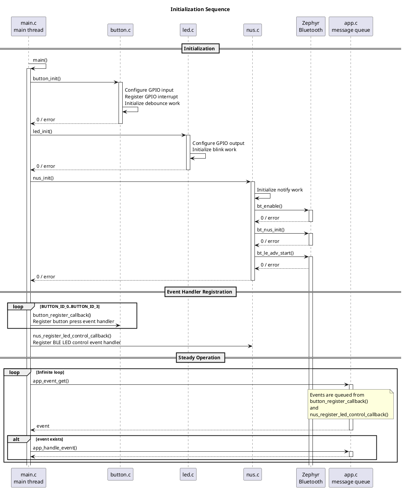
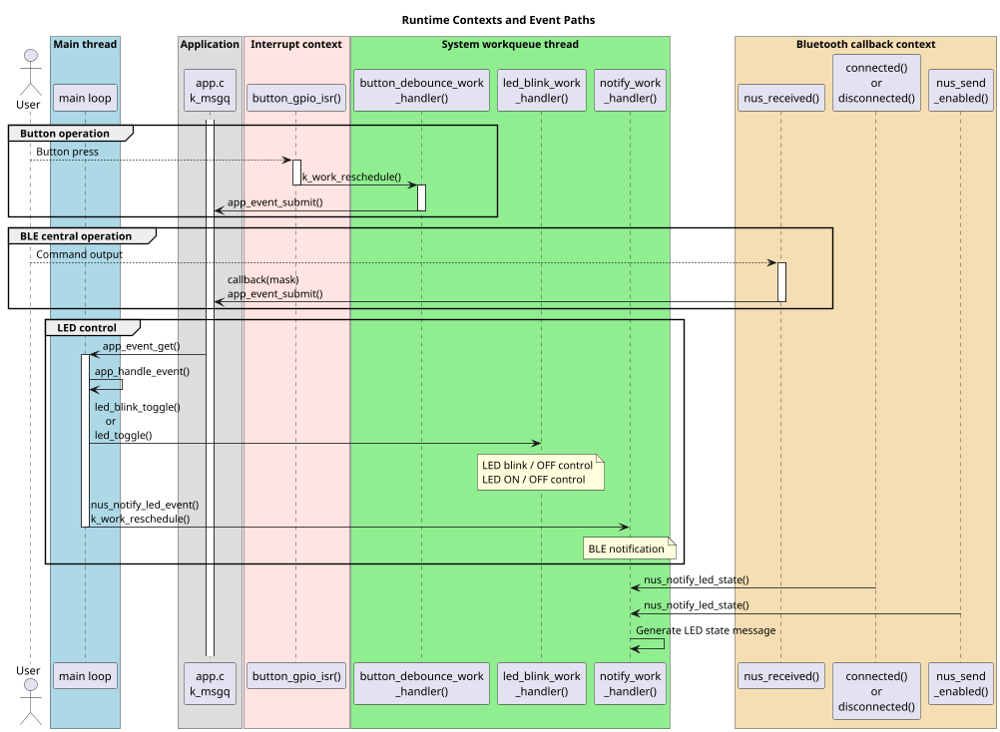
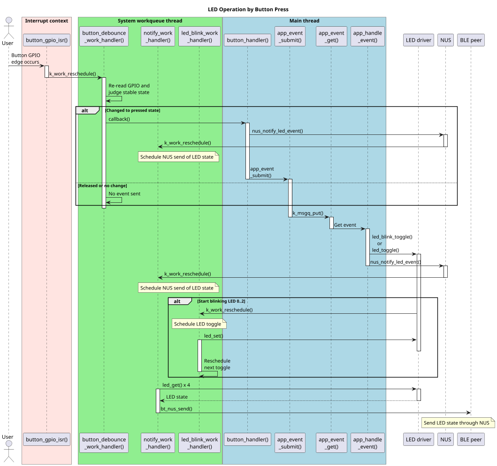
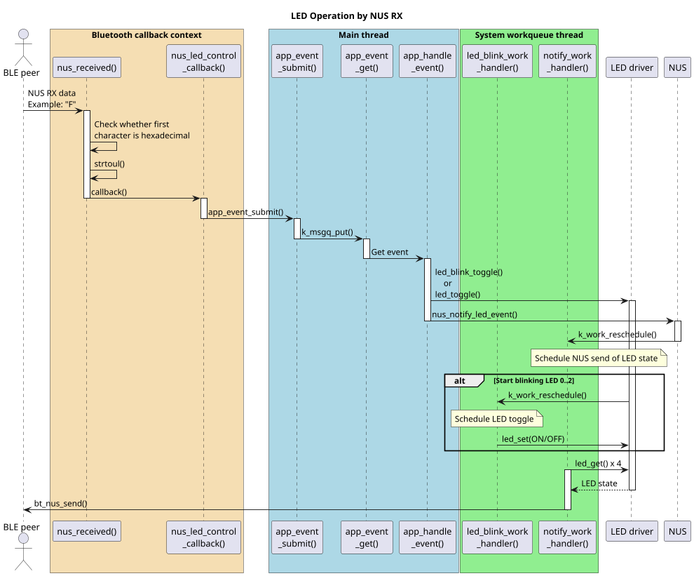
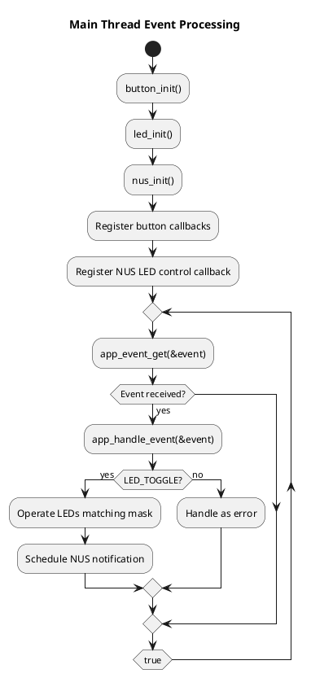
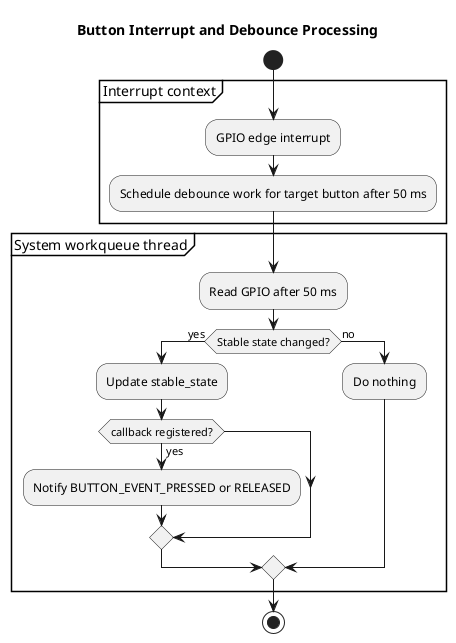

# Blinky NUS Application Specification

## 1. Purpose

This application is a Zephyr OS application that controls four buttons and four LEDs on the board, and reports or controls LED state through Bluetooth LE Nordic UART Service (NUS).

The main functions are as follows.

- Toggle blinking or ON/OFF state of the corresponding LED when a button is pressed.
- Advertise as a BLE Peripheral and communicate with external devices through NUS.
- Treat hexadecimal strings received on NUS RX as LED-control bit masks.
- Notify LED state using NUS TX notifications.

This document assumes readers who understand the C language but are not familiar with Zephyr OS.

## 2. Assumptions and Items to Confirm

### 2.1 Assumptions

- The target LEDs are the four LEDs from `LED_ID_0` to `LED_ID_3`.
- The target buttons are the four buttons from `BUTTON_ID_0` to `BUTTON_ID_3`.
- The devicetree aliases `led0` through `led3` and `sw0` through `sw3` are available.
- The BLE device name is `Blinky_NUS`, configured by `CONFIG_BT_DEVICE_NAME`.
- The maximum number of BLE connections is one, configured by `CONFIG_BT_MAX_CONN=1`.
- GPIO polarity for LEDs and buttons follows the devicetree `gpios` definitions.

### 2.2 Unknowns and Items to Confirm

This document describes the specification that can be read from the current implementation. The following items are not clearly written as requirements, so they should be confirmed as needed.

- `README.rst` is close to the description of Zephyr's standard blinky sample and does not match the current BLE/NUS implementation with four-button support.
- When a button is pressed, `nus_notify_led_event()` is called from both `button_handler()` in `main.c` and `app_toggle_leds()` in `app.c`, so notification scheduling may be duplicated. However, Zephyr delayable work is rescheduled, so the actual notification is consolidated into the last schedule.
- `nus_received()` references `data[0]` even when `len == 0`. This is unlikely to be a problem if NUS never passes a zero-byte receive, but defensively it should check `len > 0`.
- `led_blink_stop()` sets `m_led_contexts[id].is_on = false` before calling `led_set(... OFF)`, so the resulting state becomes OFF. It is undefined whether the internal state should be handled more strictly when GPIO configuration fails.
- The return value of `app_toggle_leds()` becomes the result of the last LED operation processed, but `app_handle_event()` does not use that value.

## 3. System Structure

### 3.1 Source File Structure

| File | Role |
| --- | --- |
| `src/main.c` | Initialization, callback registration, application event-processing loop |
| `src/app.c` / `src/app.h` | Application event queue and event processing |
| `src/button.c` / `src/button.h` | Button GPIO input, interrupts, debounce, button callbacks |
| `src/led.c` / `src/led.h` | LED GPIO output, ON/OFF/toggle/blink control |
| `src/nus.c` / `src/nus.h` | Bluetooth LE initialization, NUS communication, LED state notification, LED control reception from BLE |
| `prj.conf` | Zephyr configuration. Enables GPIO, BLE, NUS, and debug information |
| `boards/*.overlay` | Board-specific devicetree overrides |

### 3.2 Basic Zephyr OS Elements

The main Zephyr mechanisms used by this application are as follows.

| Zephyr element | Used in | Description |
| --- | --- | --- |
| `main()` | `src/main.c` | Runs as the Zephyr application main thread |
| GPIO driver | `button.c`, `led.c` | Handles GPIOs defined in devicetree as inputs and outputs |
| GPIO interrupt callback | `button.c` | Called in interrupt context when a button GPIO edge changes |
| `k_work_delayable` | `button.c`, `led.c`, `nus.c` | Executes processing in the system workqueue thread after a specified delay |
| `k_msgq` | `app.c` | Fixed-size queue used to pass events between threads and callbacks |
| Bluetooth callbacks | `nus.c` | Called on BLE connection, disconnection, NUS reception, notification enablement, and similar events |

An important point is that heavy processing is not performed directly inside GPIO interrupts or BLE callbacks. Instead, processing is handed off to the main loop or the workqueue.

## 4. Overall Operation

### 4.1 Initialization Flow

`main()` initializes the application in the following order.

1. `button_init()` configures each button GPIO as input, sets up both-edge interrupts, and prepares debounce work.
2. `led_init()` configures each LED GPIO as output and prepares blink work.
3. `nus_init()` initializes Bluetooth LE and NUS, then starts advertising.
4. `button_handler()` is registered for all buttons.
5. `nus_led_control_callback()` is registered to receive LED operation instructions from NUS.
6. An infinite loop waits for events using `app_event_get()` and passes received events to `app_handle_event()`.

### 4.2 Main Runtime Data Flow

Button input, BLE reception, and LED blinking occur from different contexts.

- Button input starts from a GPIO interrupt, passes through debounce work, and becomes an application event.
- BLE reception starts from the NUS receive callback and becomes an application event.
- LED blinking periodically toggles each LED using per-LED delayable work.
- NUS notification is sent to the BLE peer using notification delayable work.

## 5. Functional Specification

### 5.1 Button Input

Each button corresponds to a GPIO obtained from the devicetree aliases `sw0` through `sw3`.

| Button | Corresponding LED | Event on press |
| --- | --- | --- |
| `BUTTON_ID_0` | `LED_ID_0` | `led_mask = 0x01` |
| `BUTTON_ID_1` | `LED_ID_1` | `led_mask = 0x02` |
| `BUTTON_ID_2` | `LED_ID_2` | `led_mask = 0x04` |
| `BUTTON_ID_3` | `LED_ID_3` | `led_mask = 0x08` |

GPIO is configured as pull-up input. GPIO value `0` is treated as pressed, and `1` is treated as released. Interrupts occur on both edges, but application events are generated only for press events.

The debounce time is 50 ms, defined by `BUTTON_DEBOUNE_MS`.

### 5.2 LED Control

Each LED corresponds to a GPIO obtained from the devicetree aliases `led0` through `led3`.

When application event `APP_EVENT_TYPE_LED_TOGGLE` is processed, the following operations are performed according to the bit mask.

| bit | LED | Operation |
| --- | --- | --- |
| bit 0 | `LED_ID_0` | Start or stop blinking at 500 ms ON / 500 ms OFF |
| bit 1 | `LED_ID_1` | Start or stop blinking at 250 ms ON / 250 ms OFF |
| bit 2 | `LED_ID_2` | Start or stop blinking at 125 ms ON / 125 ms OFF |
| bit 3 | `LED_ID_3` | Simply toggle the GPIO output state |

`LED_ID_0` through `LED_ID_2` switch blinking state through `led_blink_toggle()`. If already blinking, blinking stops and the LED turns OFF. If stopped, blinking starts with the specified period.

### 5.3 BLE / NUS Communication

This application operates as a BLE Peripheral and advertises Nordic UART Service.

Advertising data includes the NUS UUID. Scan response data includes `CONFIG_BT_DEVICE_NAME`, which is `Blinky_NUS`.

NUS has the following roles.

| Direction | Content |
| --- | --- |
| NUS RX | Receives a hexadecimal string from the peer for LED control |
| NUS TX notification | Notifies the peer of LED events or LED state |

If the first character of data received on NUS RX is a hexadecimal digit, `strtoul(data, NULL, 16)` converts it to a `uint32_t` LED mask and passes it to the registered callback.

Examples:

| Received string | Interpretation | Operation |
| --- | --- | --- |
| `1` | `0x01` | Toggle blinking state of LED 0 |
| `2` | `0x02` | Toggle blinking state of LED 1 |
| `4` | `0x04` | Toggle blinking state of LED 2 |
| `8` | `0x08` | Toggle LED 3 |
| `F` | `0x0F` | Operate LED 0 through LED 3 together |

### 5.4 NUS Notification Messages

NUS TX notifications are sent by `notify_work_handler()`. They run 50 ms after being scheduled.

The message formats are as follows.

| Type | Format | Meaning |
| --- | --- | --- |
| LED event notification | `B<led_id> L=<mask>\n` | An event related to the specified LED occurred |
| State notification | `N<count> L=<mask>\n` | Current LED state notification |

`mask` is the bit mask of LEDs recognized as currently ON. bit 0 corresponds to LED 0, bit 1 to LED 1, bit 2 to LED 2, and bit 3 to LED 3.

Notifications are sent only when `m_notify_enabled == true`. This means that the peer has enabled notifications on the NUS TX characteristic.

### 5.5 Flow from Button Press to LED Control

### 5.6 Flow from BLE Reception to LED Control

### 5.7 Activity Diagrams

In the main-thread activity diagram, error display and termination are omitted to avoid redundant notation.

## 6. Per-File Function Specification

### 6.1 `src/main.c`

#### `int main(void)`

- Content: Initializes the whole application and runs the event-processing loop.
- Arguments: none.
- Return value:
  - Normally does not return.
  - Returns `-1` if initialization or callback registration fails.
- Details:
  - Calls `button_init()`, `led_init()`, and `nus_init()` in that order.
  - Registers `button_handler()` for each button.
  - Registers `nus_led_control_callback()` as the NUS LED control callback.
  - Waits for events with `app_event_get()` and processes received events with `app_handle_event()`.

#### `static void button_handler(BUTTON_ID id, BUTTON_EVENT event)`

- Content: Receives button events and sends LED-control events on press.
- Arguments:
  - `id`: Source button ID.
  - `event`: Button event type.
- Return value: none.
- Details:
  - Processes only `BUTTON_EVENT_PRESSED`.
  - Sets `led_mask` to `0x01`, `0x02`, `0x04`, or `0x08` according to the button ID.
  - Schedules a NUS notification with `nus_notify_led_event((LED_ID)id)`.
  - Sends an LED operation event to the main loop with `app_event_submit(APP_EVENT_TYPE_LED_TOGGLE, led_mask)`.

#### `static void nus_led_control_callback(uint32_t led_mask)`

- Content: Converts an LED-control mask received from BLE/NUS into an application event.
- Arguments:
  - `led_mask`: Bit mask representing target LEDs.
- Return value: none.
- Details:
  - Calls `app_event_submit(APP_EVENT_TYPE_LED_TOGGLE, led_mask)`.

### 6.2 `src/app.c`

#### `int app_event_get(APP_EVENT *event)`

- Content: Gets the next event from the application event queue.
- Arguments:
  - `event`: Pointer where the acquired event is written.
- Return value:
  - `0`: success.
  - Negative value: `event == NULL`, or an error from `k_msgq_get()`.
- Details:
  - Uses `k_msgq_get(&m_event_queue, event, K_FOREVER)`.
  - If no event exists, the calling thread waits.

#### `int app_handle_event(const APP_EVENT *event)`

- Content: Executes application processing according to the event type.
- Arguments:
  - `event`: Event to process.
- Return value:
  - `0`: success.
  - `-1`: `event == NULL`, or unknown event type.
- Details:
  - For `APP_EVENT_TYPE_LED_TOGGLE`, calls `app_toggle_leds(event->led_mask)`.
  - Outputs processing details with `printf()`.

#### `int app_event_submit(APP_EVENT_TYPE type, uint32_t led_mask)`

- Content: Puts an application event into the event queue.
- Arguments:
  - `type`: Event type.
  - `led_mask`: LED-control bit mask.
- Return value:
  - `0`: success.
  - Negative value: error from `k_msgq_put()`. This may also occur when the queue is full.
- Details:
  - Uses `K_NO_WAIT`, so it does not wait even when the queue is full.
  - The queue size is 10, defined by `APP_EVENT_QUEUE_SIZE`.

#### `static int app_toggle_leds(uint32_t led_mask)`

- Content: Operates LEDs according to the bit mask.
- Arguments:
  - `led_mask`: Bit mask indicating target LEDs.
- Return value:
  - `0`: the last executed LED operation succeeded.
  - Negative value: LED operation failed, or initial value `-1` when no target bit exists.
- Details:
  - If bit 0 is set, starts/stops `LED_ID_0` blinking with a 500 ms period.
  - If bit 1 is set, starts/stops `LED_ID_1` blinking with a 250 ms period.
  - If bit 2 is set, starts/stops `LED_ID_2` blinking with a 125 ms period.
  - If bit 3 is set, toggles `LED_ID_3`.
  - Calls `nus_notify_led_event()` for each operated LED.

### 6.3 `src/button.c`

#### `int button_init(void)`

- Content: Initializes GPIO input, interrupts, and debounce work for all buttons.
- Arguments: none.
- Return value:
  - `0`: success.
  - `-1`: GPIO device not ready, GPIO configuration failure, callback registration failure, or interrupt configuration failure.
- Details:
  - Configures GPIO obtained with `GPIO_DT_SPEC_GET()` as `GPIO_INPUT | GPIO_PULL_UP`.
  - Enables both-edge interrupts with `GPIO_INT_EDGE_BOTH`.
  - Initializes each button's stable state as `BUTTON_STATE_RELEASED`.

#### `int button_get(BUTTON_ID id, BUTTON_STATE *state)`

- Content: Gets the current state of the specified button.
- Arguments:
  - `id`: Button ID.
  - `state`: Pointer where the acquired state is written.
- Return value:
  - `0`: success.
  - `-1`: invalid argument or GPIO read failure.
- Details:
  - GPIO value `0` is `BUTTON_STATE_PRESSED`; any other value is `BUTTON_STATE_RELEASED`.

#### `int button_get_mask(uint32_t *pressed_mask)`

- Content: Gets the pressed state of all buttons as a bit mask.
- Arguments:
  - `pressed_mask`: Pointer where the pressed-state mask is written.
- Return value:
  - `0`: success.
  - `-1`: invalid argument or GPIO read failure.
- Details:
  - If bit `i` is `1`, `BUTTON_ID_i` is currently pressed.

#### `int button_register_callback(BUTTON_ID id, button_callback_t callback)`

- Content: Registers an event callback for the specified button.
- Arguments:
  - `id`: Button ID.
  - `callback`: Callback function to register.
- Return value:
  - `0`: success.
  - `-1`: invalid ID, NULL callback, or callback already registered.

#### `int button_unregister_callback(BUTTON_ID id)`

- Content: Unregisters the event callback for the specified button.
- Arguments:
  - `id`: Button ID.
- Return value:
  - `0`: success.
  - `-1`: invalid ID.

#### `static void button_gpio_isr(const struct device *dev, struct gpio_callback *cb, uint32_t pins)`

- Content: Schedules debounce work for the target button when a button GPIO interrupt occurs.
- Arguments:
  - `dev`: GPIO device that generated the interrupt.
  - `cb`: GPIO callback structure.
  - `pins`: Bit mask of interrupt pins.
- Return value: none.
- Details:
  - Runs in interrupt context.
  - Finds the target pin and calls `k_work_reschedule(..., K_MSEC(50))`.

#### `static void button_debounce_work_handler(struct k_work *work)`

- Content: Re-reads GPIO after debounce and calls the callback if the state changed.
- Arguments:
  - `work`: Executed work item.
- Return value: none.
- Details:
  - Runs in the system workqueue thread.
  - Notifies `BUTTON_EVENT_PRESSED` or `BUTTON_EVENT_RELEASED` only when the stable state changes.

### 6.4 `src/led.c`

#### `int led_init(void)`

- Content: Initializes GPIO output and blink work for all LEDs.
- Arguments: none.
- Return value:
  - `0`: success.
  - `-1`: GPIO device not ready or GPIO configuration failure.
- Details:
  - Configures each LED as `GPIO_OUTPUT_INACTIVE`.
  - Initializes each LED as blink stopped and OFF.

#### `int led_set(LED_ID id, LED_STATE state)`

- Content: Sets the specified LED to ON or OFF.
- Arguments:
  - `id`: LED ID.
  - `state`: LED state to set.
- Return value:
  - `0`: success.
  - Negative value: invalid ID or GPIO configuration failure.
- Details:
  - Updates internal state `is_on` when GPIO configuration succeeds.

#### `int led_get(LED_ID id, LED_STATE *state)`

- Content: Gets the internally managed state of the specified LED.
- Arguments:
  - `id`: LED ID.
  - `state`: Pointer where the state is written.
- Return value:
  - `0`: success.
  - `-1`: invalid ID or NULL pointer.
- Details:
  - Returns `m_led_contexts[id].is_on` instead of reading GPIO directly.

#### `int led_toggle(LED_ID id)`

- Content: Toggles the GPIO output of the specified LED.
- Arguments:
  - `id`: LED ID.
- Return value:
  - `0`: success.
  - Negative value: invalid ID or GPIO toggle failure.
- Details:
  - Inverts internal state `is_on` when GPIO toggle succeeds.

#### `int led_set_mask(uint32_t on_mask)`

- Content: Sets all LEDs ON/OFF according to a bit mask.
- Arguments:
  - `on_mask`: If bit `i` is `1`, `LED_ID_i` is ON. If `0`, it is OFF.
- Return value:
  - `0`: success.
  - `-1`: failure to set one of the LEDs.

#### `int led_toggle_mask(uint32_t toggle_mask)`

- Content: Toggles multiple LEDs according to a bit mask.
- Arguments:
  - `toggle_mask`: If bit `i` is `1`, `LED_ID_i` is toggled.
- Return value:
  - `0`: success.
  - `-1`: failure to toggle one of the LEDs.

#### `int led_blink_start(LED_ID id, uint32_t on_time_ms, uint32_t off_time_ms)`

- Content: Starts blinking the specified LED.
- Arguments:
  - `id`: LED ID.
  - `on_time_ms`: Time to keep the LED ON.
  - `off_time_ms`: Time to keep the LED OFF.
- Return value:
  - `0`: success.
  - `-1`: invalid ID.
- Details:
  - Turns the LED ON, then schedules blink work after `on_time_ms`.
  - After that, the work handler reschedules itself while switching ON/OFF.

#### `int led_blink_stop(LED_ID id)`

- Content: Stops blinking the specified LED and turns it OFF.
- Arguments:
  - `id`: LED ID.
- Return value:
  - `0`: success.
  - Negative value: invalid ID or failure to set LED OFF.
- Details:
  - Cancels blink work with `k_work_cancel_delayable()`.
  - Turns the LED OFF.

#### `int led_blink_toggle(LED_ID id, uint32_t on_time_ms, uint32_t off_time_ms)`

- Content: Toggles the blinking state of the specified LED.
- Arguments:
  - `id`: LED ID.
  - `on_time_ms`: ON time when starting blinking.
  - `off_time_ms`: OFF time when starting blinking.
- Return value:
  - `0`: success.
  - Negative value: invalid ID or start/stop failure.
- Details:
  - If blinking, calls `led_blink_stop()`.
  - If stopped, calls `led_blink_start()`.

#### `static void led_blink_work_handler(struct k_work *work)`

- Content: Switches the blinking LED ON/OFF and schedules the next work.
- Arguments:
  - `work`: Executed work item.
- Return value: none.
- Details:
  - Runs in the system workqueue thread.
  - Finds the target LED from the `work` pointer.
  - Inverts the LED state and sets the next delay to `on_time_ms` or `off_time_ms` depending on the current state.

### 6.5 `src/nus.c`

#### `int nus_init(void)`

- Content: Initializes Bluetooth LE and Nordic UART Service, then starts advertising.
- Arguments: none.
- Return value:
  - `0`: success.
  - Negative value: error from `bt_enable()`, `bt_nus_init()`, or `advertising_start()`.
- Details:
  - Initializes delayable work for notifications.
  - Registers `nus_received()` and `nus_send_enabled()` as NUS callbacks.

#### `bool nus_is_connected(void)`

- Content: Returns whether a BLE peer is connected.
- Arguments: none.
- Return value:
  - `true`: connected.
  - `false`: not connected.

#### `int nus_notify_led_state(void)`

- Content: Schedules LED state notification.
- Arguments: none.
- Return value:
  - `0`: success, or a state where notification will be skipped by later processing.
- Details:
  - Sets `m_pending_led_event` to `false` and schedules notification work after 50 ms.

#### `int nus_notify_led_event(LED_ID id)`

- Content: Schedules LED event notification.
- Arguments:
  - `id`: Changed LED ID.
- Return value:
  - `0`: success.
  - `-EINVAL`: invalid LED ID.
- Details:
  - Sets `m_pending_led_event` to `true` and saves the LED ID in `m_pending_led_id`.
  - Schedules notification work after 50 ms.

#### `int nus_register_led_control_callback(nus_led_control_callback_t callback)`

- Content: Registers the callback that connects BLE reception to LED operation.
- Arguments:
  - `callback`: Callback to register.
- Return value:
  - `0`: success.
  - `-EINVAL`: NULL callback.
  - `-EBUSY`: callback already registered.

#### `int nus_unregister_led_control_callback(void)`

- Content: Unregisters the LED control callback.
- Arguments: none.
- Return value:
  - `0`: success.
- Details:
  - In the current implementation, this succeeds even if no callback is registered.

#### `static void connected(struct bt_conn *conn, uint8_t err)`

- Content: Handles BLE connection completion.
- Arguments:
  - `conn`: Connection object.
  - `err`: Connection error. `0` means success.
- Return value: none.
- Details:
  - On success, keeps a connection reference with `bt_conn_ref()`.
  - Immediately after connection, schedules LED state notification with `nus_notify_led_state()`.

#### `static void disconnected(struct bt_conn *conn, uint8_t reason)`

- Content: Handles BLE disconnection.
- Arguments:
  - `conn`: Disconnected connection object.
  - `reason`: Disconnection reason.
- Return value: none.
- Details:
  - Releases the held connection reference with `bt_conn_unref()`.
  - Sets notification enabled state to false.
  - Starts advertising again.

#### `static void nus_received(struct bt_conn *conn, const uint8_t *const data, uint16_t len)`

- Content: Processes data received on NUS RX as an LED-control mask.
- Arguments:
  - `conn`: Source connection object.
  - `data`: Received data.
  - `len`: Received data length.
- Return value: none.
- Details:
  - If `data[0]` is a hexadecimal digit, converts it to a mask with `strtoul()`.
  - If an LED control callback is registered, calls `callback(mask)`.
  - Outputs received content with `printf()`.

#### `static void nus_send_enabled(enum bt_nus_send_status status)`

- Content: Updates the enabled/disabled state of NUS TX notifications.
- Arguments:
  - `status`: Notification enabled state.
- Return value: none.
- Details:
  - If `BT_NUS_SEND_STATUS_ENABLED`, sets `m_notify_enabled = true`.
  - When enabled, schedules current-state notification with `nus_notify_led_state()`.

#### `static void notify_work_handler(struct k_work *work)`

- Content: Creates an LED state message and sends it as a NUS TX notification.
- Arguments:
  - `work`: Executed work item.
- Return value: none.
- Details:
  - Does nothing if notifications are disabled.
  - Prefixes the message with `B<id> ` for LED event notifications, or `N<count> ` for normal state notifications.
  - Appends `L=<mask>\n` with `led_state_message()`.
  - Sends it with `bt_nus_send(NULL, ...)`.

#### `static void notify_schedule(void)`

- Content: Schedules notification work after 50 ms.
- Arguments: none.
- Return value: none.
- Details:
  - Calls `k_work_reschedule(&m_notify_work, K_MSEC(50))`.

#### `static int advertising_start(void)`

- Content: Starts BLE advertising.
- Arguments: none.
- Return value:
  - `0`: success, or already advertising.
  - Negative value: error from `bt_le_adv_start()`. However, `-EALREADY` is treated as success.
- Details:
  - Includes the NUS UUID in advertising data.
  - Includes the device name in scan response data.

#### `static int led_state_message(char *buf, size_t buf_size)`

- Content: Generates LED state string `L=<mask>\n`.
- Arguments:
  - `buf`: Destination buffer.
  - `buf_size`: Buffer size.
- Return value:
  - Positive value or `0`: number of bytes written.
  - Negative value: LED state acquisition failure or insufficient buffer.
- Details:
  - Gets the state mask with `led_state_mask()`.
  - Converts it to a string with `snprintf()`.

#### `static int led_state_mask(uint32_t *mask)`

- Content: Converts all LED ON/OFF states to a bit mask.
- Arguments:
  - `mask`: Pointer where the generated mask is written.
- Return value:
  - `0`: success.
  - Negative value: error from `led_get()`.
- Details:
  - Sets the bit corresponding to each `LED_STATE_ON` LED to `1`.

## 7. Data Type Specification

### 7.1 `APP_EVENT_TYPE`

| Value | Meaning |
| --- | --- |
| `APP_EVENT_TYPE_LED_TOGGLE` | LED operation event |

### 7.2 `APP_EVENT`

| Member | Type | Meaning |
| --- | --- | --- |
| `type` | `APP_EVENT_TYPE` | Event type |
| `led_mask` | `uint32_t` | LED-control bit mask |

### 7.3 `BUTTON_ID`

| Value | Meaning |
| --- | --- |
| `BUTTON_ID_0` | on-board button-1 |
| `BUTTON_ID_1` | on-board button-2 |
| `BUTTON_ID_2` | on-board button-3 |
| `BUTTON_ID_3` | on-board button-4 |
| `BUTTON_ID_COUNT` | Number of buttons |

### 7.4 `BUTTON_STATE`

| Value | Meaning |
| --- | --- |
| `BUTTON_STATE_RELEASED` | Released state |
| `BUTTON_STATE_PRESSED` | Pressed state |

### 7.5 `BUTTON_EVENT`

| Value | Meaning |
| --- | --- |
| `BUTTON_EVENT_NONE` | No event |
| `BUTTON_EVENT_PRESSED` | Press event |
| `BUTTON_EVENT_RELEASED` | Release event |

### 7.6 `LED_ID`

| Value | Meaning |
| --- | --- |
| `LED_ID_0` | on-board LED-1 |
| `LED_ID_1` | on-board LED-2 |
| `LED_ID_2` | on-board LED-3 |
| `LED_ID_3` | on-board LED-4 |
| `LED_ID_COUNT` | Number of LEDs |

### 7.7 `LED_STATE`

| Value | Meaning |
| --- | --- |
| `LED_STATE_OFF` | OFF |
| `LED_STATE_ON` | ON |

## 8. Error Handling Specification

- If initialization fails, `main()` outputs an error message and returns `-1`.
- The button and LED modules return many errors as `-1`.
- The NUS module returns negative error codes originating from Zephyr/Bluetooth APIs, and also returns `-EINVAL` and `-EBUSY` in some places.
- Application event queue insertion uses `K_NO_WAIT`, so if the queue is full the event is not inserted and an error is returned. However, there are places where the caller does not check the return value.

## 9. Build Settings

The main settings enabled in `prj.conf` are as follows.

| Setting | Content |
| --- | --- |
| `CONFIG_GPIO=y` | Enables the GPIO driver |
| `CONFIG_BT=y` | Enables the Bluetooth subsystem |
| `CONFIG_BT_PERIPHERAL=y` | Enables BLE Peripheral functionality |
| `CONFIG_BT_DEVICE_NAME="Blinky_NUS"` | BLE device name |
| `CONFIG_BT_MAX_CONN=1` | Maximum BLE connections: 1 |
| `CONFIG_BT_NUS=y` | Enables Nordic UART Service |
| `CONFIG_DEBUG=y` | Enables debug functionality |
| `CONFIG_DEBUG_OPTIMIZATIONS=y` | Debug-oriented optimization |
| `CONFIG_DEBUG_THREAD_INFO=y` | Enables thread information |

## 10. Constraints

- LEDs and buttons are implemented as fixed arrays of four elements.
- NUS receive commands only check whether the first character is a hexadecimal digit; the command scheme is limited to bit-mask strings.
- NUS notification message size is limited to 20 bytes by `LED_STATE_MSG_SIZE`.
- LED state notification is based on internal state `is_on`, and does not directly read back the actual GPIO state.
- Because `k_work_delayable` is used, blink periods and notification timing are affected by system workqueue load.
